# PlantCare AI - System Documentation

## Table of Contents
1. [System Overview](#system-overview)
2. [System Architecture](#system-architecture)
3. [Use Case Diagrams](#use-case-diagrams)
4. [Data Flow Diagram (Level 0)](#data-flow-diagram-level-0)
5. [Entity Relationship Diagram](#entity-relationship-diagram)
6. [Sequence Diagrams](#sequence-diagrams)

---

## System Overview

**PlantCare AI** is an intelligent plant disease detection and management system that helps farmers and gardeners identify plant diseases through AI-powered image analysis. The system includes a community forum, disease encyclopedia, and an AI chatbot assistant.

### Key Features
- **AI Disease Detection**: Upload plant images for instant disease diagnosis
- **Community Forum**: Discuss plant health issues with other users
- **Disease Encyclopedia**: Comprehensive database of plant diseases
- **AI Chatbot**: Get instant answers about plant care
- **Admin Panel**: Manage content and moderate the community

---

## System Architecture

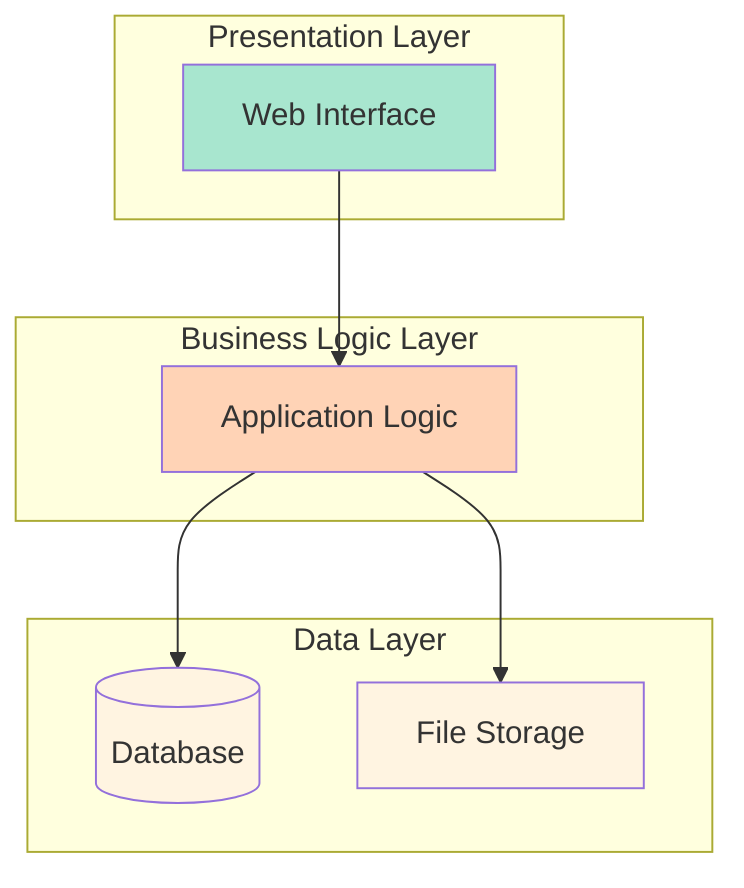
```mermaid
graph TB
    subgraph "Presentation Layer"
        UI[Web Interface]
    end
    
    subgraph "Business Logic Layer"
        App[Application Logic]
    end
    
    subgraph "Data Layer"
        DB[(Database)]
        Files[File Storage]
    end
    
    UI --> App
    App --> DB
    App --> Files
    
    style UI fill:#a8e6cf
    style App fill:#ffd3b6
    style DB fill:#fff4e1
    style Files fill:#fff4e1
```

---

## Use Case Diagrams

### User Use Cases

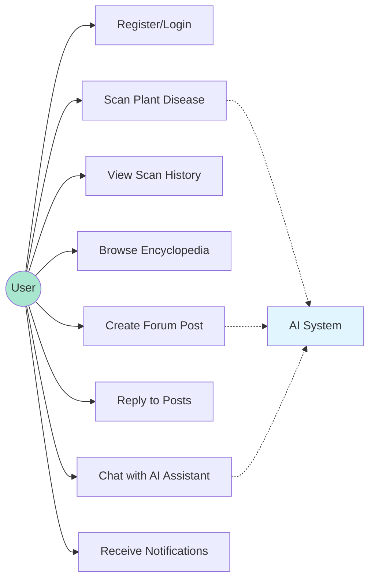
```mermaid
graph LR
    User((User))
    AI[AI System]
    
    User --> UC1[Register/Login]
    User --> UC2[Scan Plant Disease]
    User --> UC3[View Scan History]
    User --> UC4[Browse Encyclopedia]
    User --> UC5[Create Forum Post]
    User --> UC6[Reply to Posts]
    User --> UC7[Chat with AI Assistant]
    User --> UC8[Receive Notifications]
    
    UC2 -.-> AI
    UC5 -.-> AI
    UC7 -.-> AI
    
    style User fill:#a8e6cf
    style AI fill:#e1f5ff
```

### Administrator Use Cases

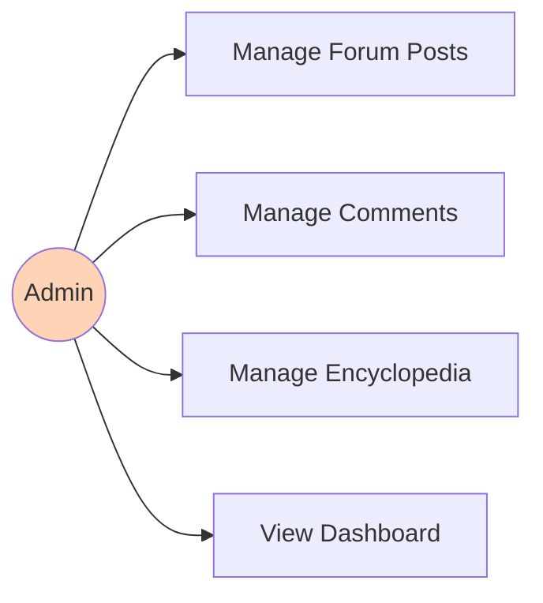
```mermaid
graph LR
    Admin((Admin))
    
    Admin --> UC1[Manage Forum Posts]
    Admin --> UC2[Manage Comments]
    Admin --> UC3[Manage Encyclopedia]
    Admin --> UC4[View Dashboard]
    
    style Admin fill:#ffd3b6
```

---

## Data Flow Diagram (Level 0)

### Context Diagram

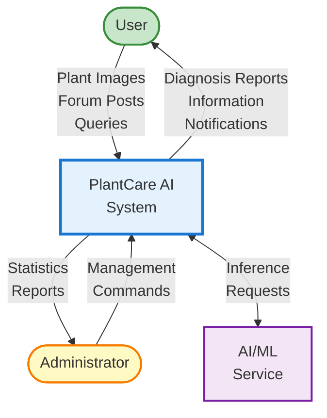
```mermaid
graph TB
    User([User])
    Admin([Administrator])
    
    System[PlantCare AI<br/>System]
    
    User -->|Plant Images<br/>Forum Posts<br/>Queries| System
    System -->|Diagnosis Reports<br/>Information<br/>Notifications| User
    
    Admin -->|Management<br/>Commands| System
    System -->|Statistics<br/>Reports| Admin
    
    AI[AI/ML<br/>Service]
    System <-->|Inference<br/>Requests| AI
    
    style System fill:#e3f2fd,stroke:#1976d2,stroke-width:3px
    style User fill:#c8e6c9,stroke:#388e3c,stroke-width:2px
    style Admin fill:#fff9c4,stroke:#f57c00,stroke-width:2px
    style AI fill:#f3e5f5,stroke:#7b1fa2,stroke-width:2px
```

### Level 0 DFD - Main Processes

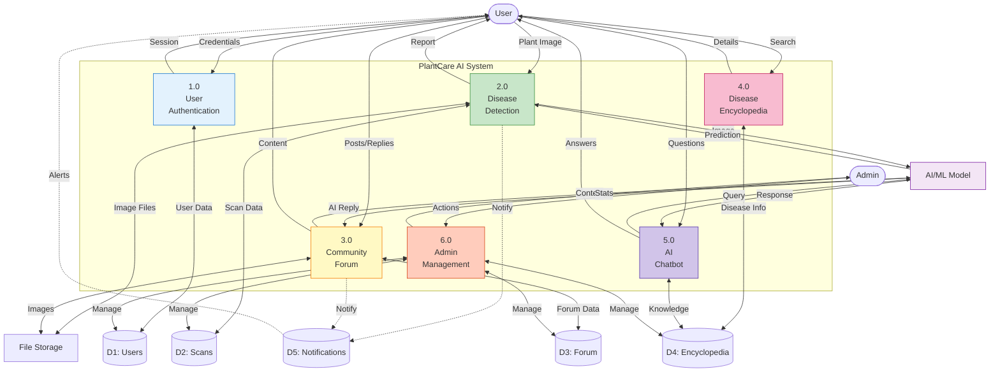
```mermaid
graph TB
    User([User])
    Admin([Admin])
    
    subgraph "PlantCare AI System"
        P1[1.0<br/>User<br/>Authentication]
        P2[2.0<br/>Disease<br/>Detection]
        P3[3.0<br/>Community<br/>Forum]
        P4[4.0<br/>Disease<br/>Encyclopedia]
        P5[5.0<br/>AI<br/>Chatbot]
        P6[6.0<br/>Admin<br/>Management]
    end
    
    D1[(D1: Users)]
    D2[(D2: Scans)]
    D3[(D3: Forum)]
    D4[(D4: Encyclopedia)]
    D5[(D5: Notifications)]
    FS[File Storage]
    
    AI[AI/ML Model]
    
    User -->|Credentials| P1
    P1 <-->|User Data| D1
    P1 -->|Session| User
    
    User -->|Plant Image| P2
    P2 -->|Image| AI
    AI -->|Prediction| P2
    P2 <-->|Scan Data| D2
    P2 <-->|Image Files| FS
    P2 -->|Report| User
    P2 -.->|Notify| D5
    
    User -->|Posts/Replies| P3
    P3 -->|Context| AI
    AI -->|AI Reply| P3
    P3 <-->|Forum Data| D3
    P3 <-->|Images| FS
    P3 -->|Content| User
    P3 -.->|Notify| D5
    
    User -->|Search| P4
    P4 <-->|Disease Info| D4
    P4 -->|Details| User
    
    User -->|Questions| P5
    P5 -->|Query| AI
    AI -->|Response| P5
    P5 <-->|Knowledge| D4
    P5 -->|Answers| User
    
    Admin -->|Actions| P6
    P6 <-->|Manage| D1
    P6 <-->|Manage| D2
    P6 <-->|Manage| D3
    P6 <-->|Manage| D4
    P6 -->|Stats| Admin
    
    D5 -.->|Alerts| User
    
    style P1 fill:#e3f2fd,stroke:#1976d2
    style P2 fill:#c8e6c9,stroke:#388e3c
    style P3 fill:#fff9c4,stroke:#f57c00
    style P4 fill:#f8bbd0,stroke:#c2185b
    style P5 fill:#d1c4e9,stroke:#512da8
    style P6 fill:#ffccbc,stroke:#d84315
    style AI fill:#f3e5f5,stroke:#7b1fa2
```

---

## Entity Relationship Diagram

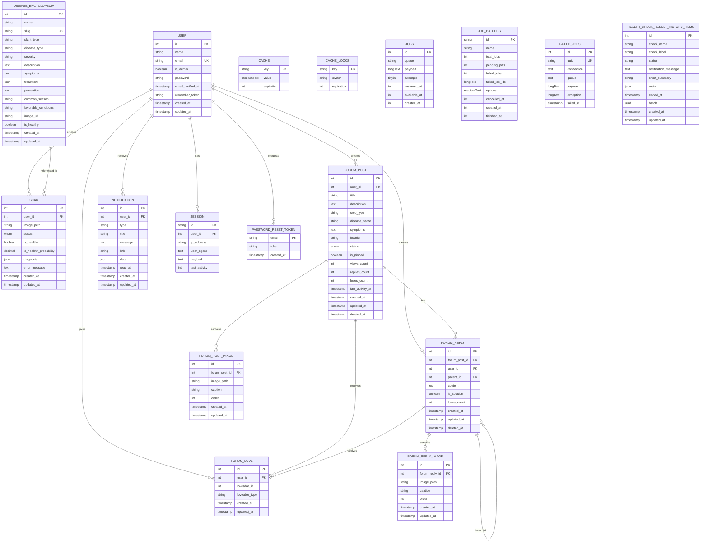
```mermaid
erDiagram
    USER ||--o{ SCAN : creates
    USER ||--o{ FORUM_POST : creates
    USER ||--o{ FORUM_REPLY : creates
    USER ||--o{ NOTIFICATION : receives
    USER ||--o{ FORUM_LOVE : gives
    USER ||--o{ SESSION : has
    USER ||--o{ PASSWORD_RESET_TOKEN : requests
    
    FORUM_POST ||--o{ FORUM_REPLY : has
    FORUM_POST ||--o{ FORUM_POST_IMAGE : contains
    FORUM_POST ||--o{ FORUM_LOVE : receives
    
    FORUM_REPLY ||--o{ FORUM_REPLY : "has child"
    FORUM_REPLY ||--o{ FORUM_REPLY_IMAGE : contains
    FORUM_REPLY ||--o{ FORUM_LOVE : receives
    
    DISEASE_ENCYCLOPEDIA ||--o{ SCAN : "referenced in"
    
    USER {
        int id PK
        string name
        string email UK
        boolean is_admin
        string password
        timestamp email_verified_at
        string remember_token
        timestamp created_at
        timestamp updated_at
    }
    
    SCAN {
        int id PK
        int user_id FK
        string image_path
        enum status
        boolean is_healthy
        decimal is_healthy_probability
        json diagnosis
        text error_message
        timestamp created_at
        timestamp updated_at
    }
    
    FORUM_POST {
        int id PK
        int user_id FK
        string title
        text description
        string crop_type
        string disease_name
        text symptoms
        string location
        enum status
        boolean is_pinned
        int views_count
        int replies_count
        int loves_count
        timestamp last_activity_at
        timestamp created_at
        timestamp updated_at
        timestamp deleted_at
    }
    
    FORUM_REPLY {
        int id PK
        int forum_post_id FK
        int user_id FK
        int parent_id FK
        text content
        boolean is_solution
        int loves_count
        timestamp created_at
        timestamp updated_at
        timestamp deleted_at
    }
    
    FORUM_POST_IMAGE {
        int id PK
        int forum_post_id FK
        string image_path
        string caption
        int order
        timestamp created_at
        timestamp updated_at
    }
    
    FORUM_REPLY_IMAGE {
        int id PK
        int forum_reply_id FK
        string image_path
        string caption
        int order
        timestamp created_at
        timestamp updated_at
    }
    
    FORUM_LOVE {
        int id PK
        int user_id FK
        int loveable_id
        string loveable_type
        timestamp created_at
        timestamp updated_at
    }
    
    DISEASE_ENCYCLOPEDIA {
        int id PK
        string name
        string slug UK
        string plant_type
        string disease_type
        string severity
        text description
        json symptoms
        json treatment
        json prevention
        string common_season
        string favorable_conditions
        string image_url
        boolean is_healthy
        timestamp created_at
        timestamp updated_at
    }
    
    NOTIFICATION {
        int id PK
        int user_id FK
        string type
        string title
        text message
        string link
        json data
        timestamp read_at
        timestamp created_at
        timestamp updated_at
    }
    
    SESSION {
        string id PK
        int user_id FK
        string ip_address
        text user_agent
        text payload
        int last_activity
    }
    
    PASSWORD_RESET_TOKEN {
        string email PK
        string token
        timestamp created_at
    }

    CACHE {
        string key PK
        mediumText value
        int expiration
    }

    CACHE_LOCKS {
        string key PK
        string owner
        int expiration
    }

    JOBS {
        int id PK
        string queue
        longText payload
        tinyint attempts
        int reserved_at
        int available_at
        int created_at
    }

    JOB_BATCHES {
        string id PK
        string name
        int total_jobs
        int pending_jobs
        int failed_jobs
        longText failed_job_ids
        mediumText options
        int cancelled_at
        int created_at
        int finished_at
    }

    FAILED_JOBS {
        int id PK
        string uuid UK
        text connection
        text queue
        longText payload
        longText exception
        timestamp failed_at
    }

    HEALTH_CHECK_RESULT_HISTORY_ITEMS {
        int id PK
        string check_name
        string check_label
        string status
        text notification_message
        string short_summary
        json meta
        timestamp ended_at
        uuid batch
        timestamp created_at
        timestamp updated_at
    }
```

---

## Sequence Diagrams

> **Note**: Simplified for IEEE academic reports. Each diagram shows core interactions only.

### SD-1: User Authentication

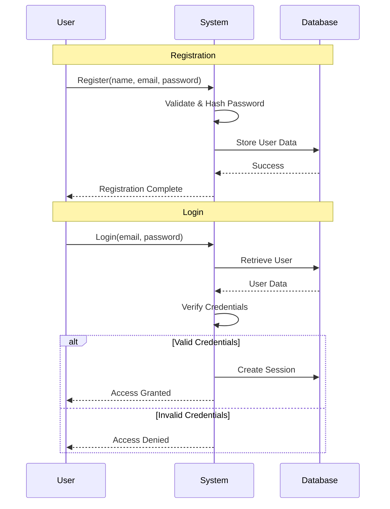
```mermaid
sequenceDiagram
    participant U as User
    participant S as System
    participant DB as Database
    
    Note over U,DB: Registration
    U->>S: Register(name, email, password)
    S->>S: Validate & Hash Password
    S->>DB: Store User Data
    DB-->>S: Success
    S-->>U: Registration Complete
    
    Note over U,DB: Login
    U->>S: Login(email, password)
    S->>DB: Retrieve User
    DB-->>S: User Data
    S->>S: Verify Credentials
    
    alt Valid Credentials
        S->>DB: Create Session
        S-->>U: Access Granted
    else Invalid Credentials
        S-->>U: Access Denied
    end
```

### SD-2: Disease Detection Process

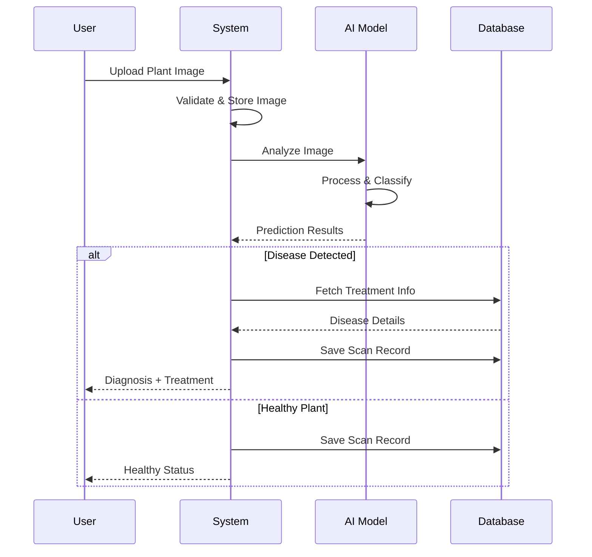
```mermaid
sequenceDiagram
    participant U as User
    participant S as System
    participant AI as AI Model
    participant DB as Database
    
    U->>S: Upload Plant Image
    S->>S: Validate & Store Image
    S->>AI: Analyze Image
    AI->>AI: Process & Classify
    AI-->>S: Prediction Results
    
    alt Disease Detected
        S->>DB: Fetch Treatment Info
        DB-->>S: Disease Details
        S->>DB: Save Scan Record
        S-->>U: Diagnosis + Treatment
    else Healthy Plant
        S->>DB: Save Scan Record
        S-->>U: Healthy Status
    end
```

### SD-3: Forum Post Creation

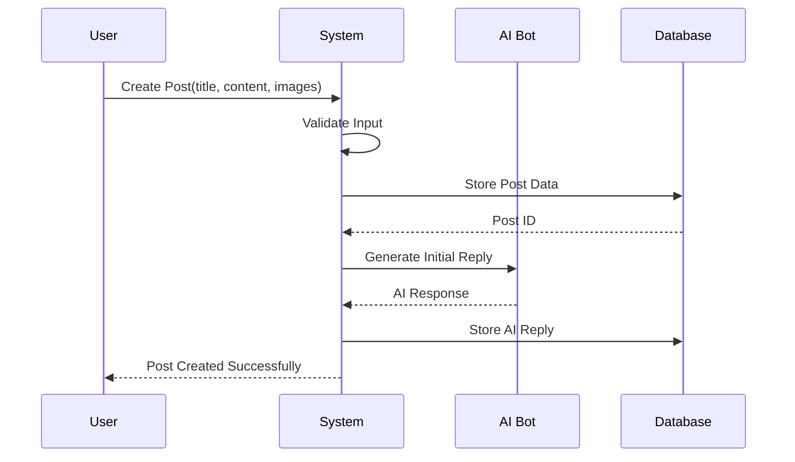
```mermaid
sequenceDiagram
    participant U as User
    participant S as System
    participant AI as AI Bot
    participant DB as Database
    
    U->>S: Create Post(title, content, images)
    S->>S: Validate Input
    S->>DB: Store Post Data
    DB-->>S: Post ID
    
    S->>AI: Generate Initial Reply
    AI-->>S: AI Response
    S->>DB: Store AI Reply
    
    S-->>U: Post Created Successfully
```

### SD-4: Community Interaction

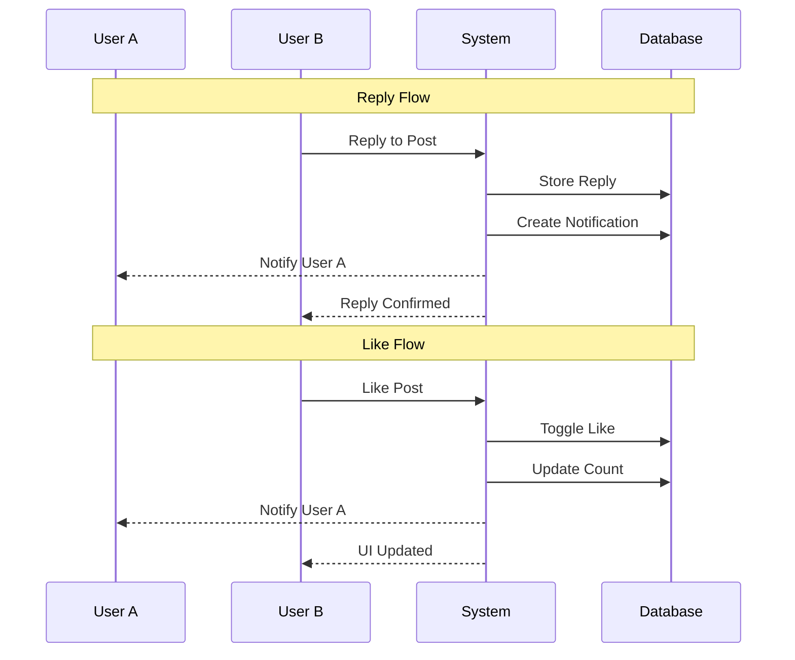
```mermaid
sequenceDiagram
    participant U1 as User A
    participant U2 as User B
    participant S as System
    participant DB as Database
    
    Note over U1,DB: Reply Flow
    U2->>S: Reply to Post
    S->>DB: Store Reply
    S->>DB: Create Notification
    S-->>U1: Notify User A
    S-->>U2: Reply Confirmed
    
    Note over U1,DB: Like Flow
    U2->>S: Like Post
    S->>DB: Toggle Like
    S->>DB: Update Count
    S-->>U1: Notify User A
    S-->>U2: UI Updated
```

### SD-5: AI Chatbot Interaction

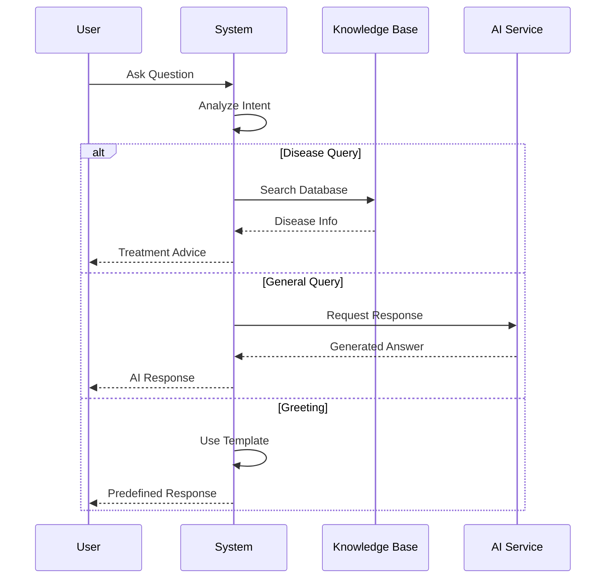
```mermaid
sequenceDiagram
    participant U as User
    participant S as System
    participant KB as Knowledge Base
    participant AI as AI Service
    
    U->>S: Ask Question
    S->>S: Analyze Intent
    
    alt Disease Query
        S->>KB: Search Database
        KB-->>S: Disease Info
        S-->>U: Treatment Advice
    else General Query
        S->>AI: Request Response
        AI-->>S: Generated Answer
        S-->>U: AI Response
    else Greeting
        S->>S: Use Template
        S-->>U: Predefined Response
    end
```

### SD-6: View Scan History

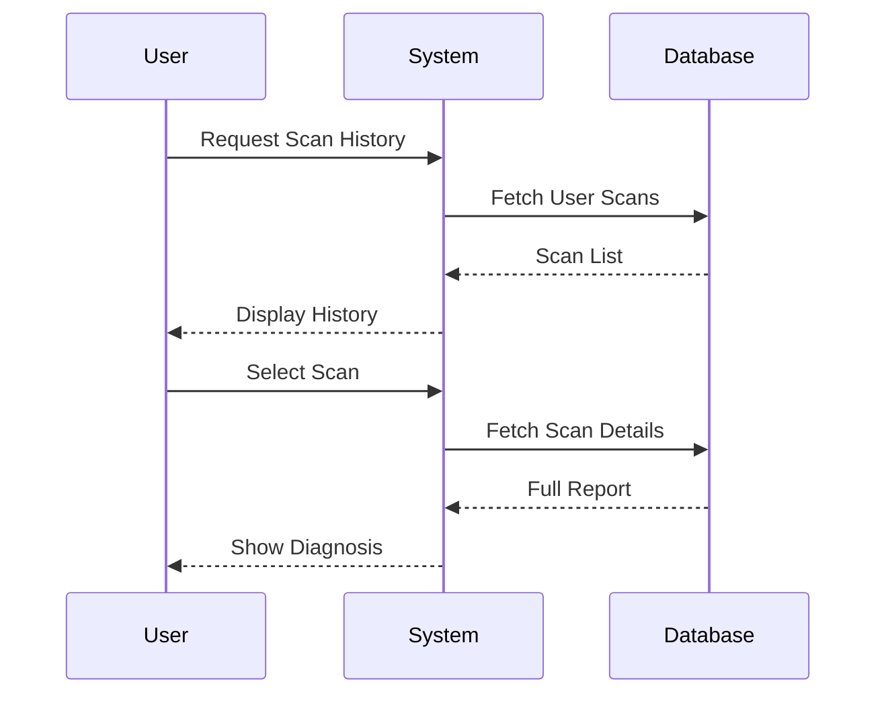
```mermaid
sequenceDiagram
    participant U as User
    participant S as System
    participant DB as Database
    
    U->>S: Request Scan History
    S->>DB: Fetch User Scans
    DB-->>S: Scan List
    S-->>U: Display History
    
    U->>S: Select Scan
    S->>DB: Fetch Scan Details
    DB-->>S: Full Report
    S-->>U: Show Diagnosis
```

### SD-7: Admin Forum Management

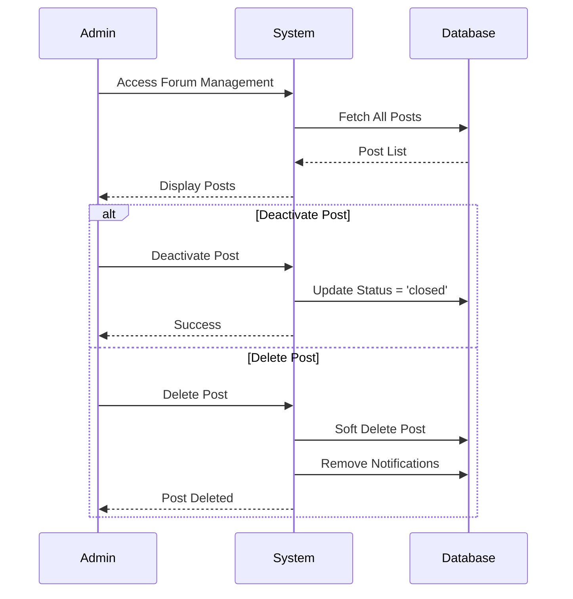
```mermaid
sequenceDiagram
    participant A as Admin
    participant S as System
    participant DB as Database
    
    A->>S: Access Forum Management
    S->>DB: Fetch All Posts
    DB-->>S: Post List
    S-->>A: Display Posts
    
    alt Deactivate Post
        A->>S: Deactivate Post
        S->>DB: Update Status = 'closed'
        S-->>A: Success
    else Delete Post
        A->>S: Delete Post
        S->>DB: Soft Delete Post
        S->>DB: Remove Notifications
        S-->>A: Post Deleted
    end
```

### SD-8: Admin Encyclopedia Management

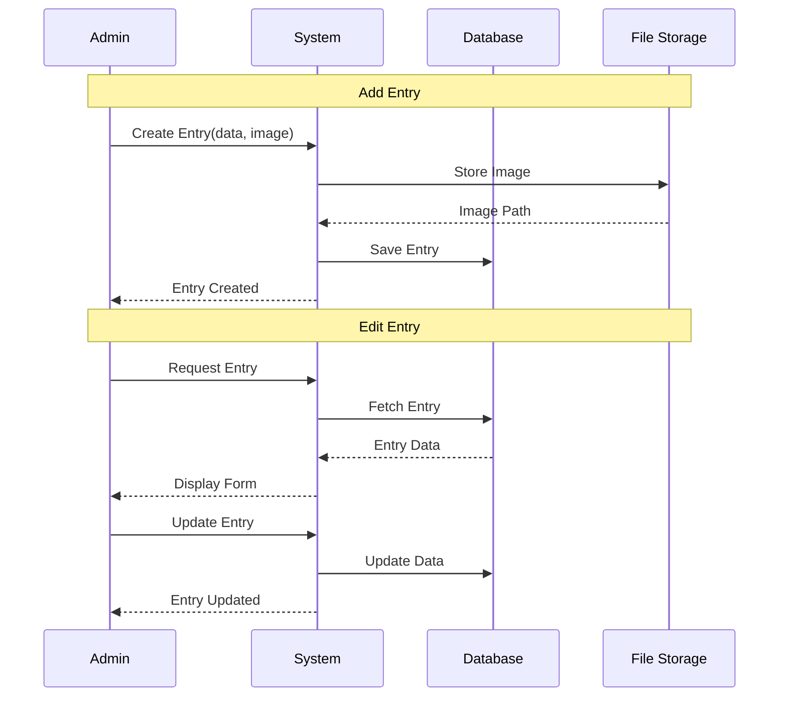
```mermaid
sequenceDiagram
    participant A as Admin
    participant S as System
    participant DB as Database
    participant FS as File Storage
    
    Note over A,FS: Add Entry
    A->>S: Create Entry(data, image)
    S->>FS: Store Image
    FS-->>S: Image Path
    S->>DB: Save Entry
    S-->>A: Entry Created
    
    Note over A,FS: Edit Entry
    A->>S: Request Entry
    S->>DB: Fetch Entry
    DB-->>S: Entry Data
    S-->>A: Display Form
    A->>S: Update Entry
    S->>DB: Update Data
    S-->>A: Entry Updated
```

### SD-9: Notification System

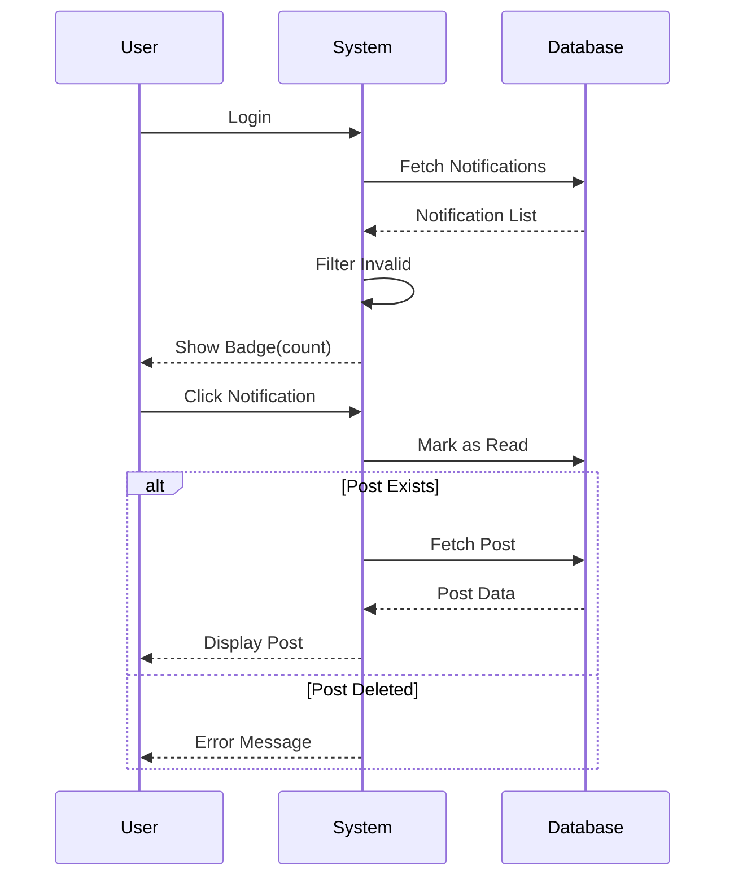
```mermaid
sequenceDiagram
    participant U as User
    participant S as System
    participant DB as Database
    
    U->>S: Login
    S->>DB: Fetch Notifications
    DB-->>S: Notification List
    S->>S: Filter Invalid
    S-->>U: Show Badge(count)
    
    U->>S: Click Notification
    S->>DB: Mark as Read
    
    alt Post Exists
        S->>DB: Fetch Post
        DB-->>S: Post Data
        S-->>U: Display Post
    else Post Deleted
        S-->>U: Error Message
    end
```

### SD-10: User Profile Update

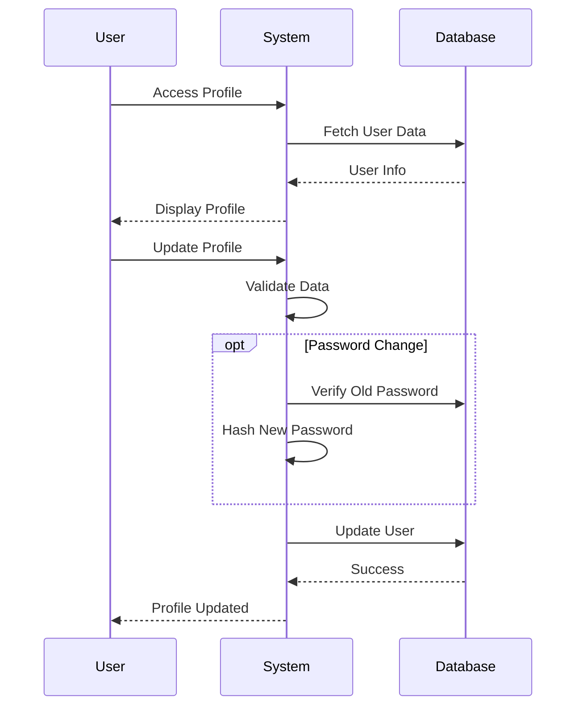
```mermaid
sequenceDiagram
    participant U as User
    participant S as System
    participant DB as Database
    
    U->>S: Access Profile
    S->>DB: Fetch User Data
    DB-->>S: User Info
    S-->>U: Display Profile
    
    U->>S: Update Profile
    S->>S: Validate Data
    
    opt Password Change
        S->>DB: Verify Old Password
        S->>S: Hash New Password
    end
    
    S->>DB: Update User
    DB-->>S: Success
    S-->>U: Profile Updated
```

---

## System Workflow Summary

### For Regular Users:
1. **Register/Login** → Access the system
2. **Scan Plant** → Upload image → Get AI diagnosis
3. **Browse Encyclopedia** → Learn about diseases
4. **Join Community** → Create posts, reply, interact
5. **Use AI Assistant** → Get instant answers
6. **Receive Notifications** → Stay updated on interactions

### For Administrators:
1. **Login to Admin Panel** → Access management dashboard
2. **Monitor Statistics** → View system analytics
3. **Moderate Forum** → Activate/deactivate/delete posts
4. **Manage Comments** → Remove inappropriate content
5. **Maintain Encyclopedia** → Add/edit disease information
6. **Ensure Quality** → Keep the platform helpful and safe

---

## Key System Benefits

### For Users:
- **Quick Diagnosis**: Instant disease detection using AI
- **Expert Knowledge**: Access to comprehensive disease encyclopedia
- **Community Support**: Connect with other plant enthusiasts
- **24/7 Assistance**: AI chatbot available anytime
- **Track History**: View all previous scans and posts

### For Administrators:
- **Centralized Control**: Manage all aspects from one dashboard
- **Data Insights**: View statistics and user activity
- **Content Moderation**: Ensure quality discussions
- **Knowledge Management**: Maintain accurate disease information
- **User Safety**: Protect community from spam and abuse

---

*This documentation provides a comprehensive overview of the PlantCare AI system architecture and functionality, designed for academic and technical review purposes.*

---

## IEEE Academic Report Guidelines

### Recommended Diagrams for A4 Reports

**Essential Diagrams (Must Include):**
1. **Context Diagram** - Shows system boundaries and external entities
2. **DFD Level 0** - Main system processes
3. **Use Case Diagram** - Functional requirements
4. **ERD (Simplified)** - Database design
5. **2-3 Key Sequence Diagrams**:
   - SD-2: Disease Detection (core feature)
   - SD-3: Forum Post Creation (community feature)
   - SD-7: Admin Management (admin feature)

**Optional (Based on Space):**
- System Architecture Diagram
- Additional Sequence Diagrams
- Component Diagram

### Diagram Formatting Tips

**Figure Captions:**
- Place captions below diagrams
- Format: *Figure X: [Diagram Type] - [Description]*
- Example: *Figure 1: Data Flow Diagram - Level 0 Context*

**Sizing for IEEE Papers:**
- Single column width: 3.5 inches (88.9mm)
- Double column width: 7 inches (177.8mm)
- Ensure text remains readable at target size

**Resolution:**
- Export at minimum 300 DPI for print quality
- Use vector formats (SVG, PDF) when possible
- PNG acceptable for raster images

**References in Text:**
- Cite diagrams in your report text
- Example: "The system architecture (Fig. 2) demonstrates..."
- Example: "As shown in the sequence diagram (Fig. 5)..."

**Consistency:**
- Use same notation style throughout
- Maintain consistent color scheme
- Keep participant names uniform across diagrams

### Diagram Selection Guide

**For System Overview:**
- Use Context Diagram + DFD Level 0

**For Functional Requirements:**
- Use Use Case Diagrams

**For Process Flows:**
- Select 3-5 most critical Sequence Diagrams
- Focus on: Authentication, Core Features, Admin Functions

**For Data Design:**
- Use ERD (Simplified version)

**For Architecture:**
- Use System Architecture Diagram

### Export Instructions

1. **From Mermaid Live Editor:**
   - Copy diagram code
   - Paste into [Mermaid Live Editor](https://mermaid.live)
   - Export as SVG or PNG
   - Set appropriate resolution

2. **Sizing:**
   - Resize to fit A4 page width
   - Ensure readability after scaling
   - Test print before final submission

3. **Quality Check:**
   - Verify all text is legible
   - Check arrow directions are clear
   - Ensure colors are distinguishable in grayscale

---

**Document Version:** 2.0  
**Last Updated:** November 2025  
**Format:** IEEE Academic Standard  
**Page Size:** A4 (210mm × 297mm)
