# PlantCare AI - System Documentation

## Table of Contents
1. [System Overview](#system-overview)
2. [System Architecture](#system-architecture)
3. [Use Case Diagrams](#use-case-diagrams)
4. [Data Flow Diagram (Level 0)](#data-flow-diagram-level-0)
5. [Entity Relationship Diagram](#entity-relationship-diagram)
6. [Sequence Diagrams](#sequence-diagrams)

---

## System Overview

**PlantCare AI** is an intelligent plant disease detection and management system that helps farmers and gardeners identify plant diseases through AI-powered image analysis. The system includes a community forum, disease encyclopedia, and an AI chatbot assistant.

### Key Features
- **AI Disease Detection**: Upload plant images for instant disease diagnosis
- **Community Forum**: Discuss plant health issues with other users
- **Disease Encyclopedia**: Comprehensive database of plant diseases
- **AI Chatbot**: Get instant answers about plant care
- **Admin Panel**: Manage content and moderate the community

---

## System Architecture

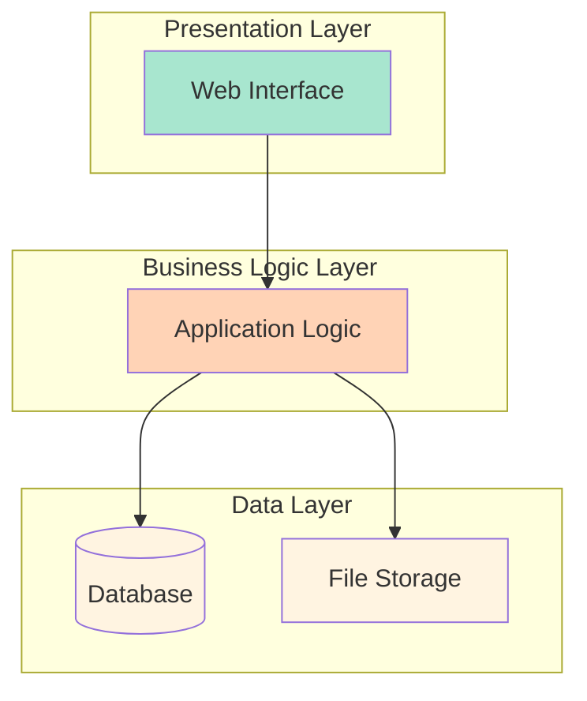
```mermaid
graph TB
    subgraph "Presentation Layer"
        UI[Web Interface]
    end
    
    subgraph "Business Logic Layer"
        App[Application Logic]
    end
    
    subgraph "Data Layer"
        DB[(Database)]
        Files[File Storage]
    end
    
    UI --> App
    App --> DB
    App --> Files
    
    style UI fill:#a8e6cf
    style App fill:#ffd3b6
    style DB fill:#fff4e1
    style Files fill:#fff4e1
```

---

## Use Case Diagrams

### User Use Cases

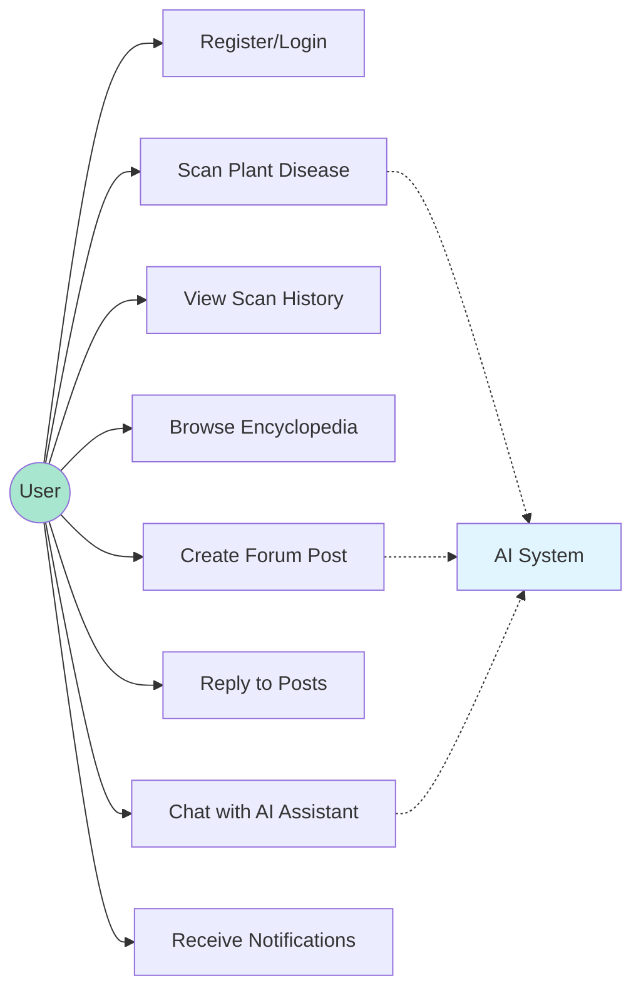
```mermaid
graph LR
    User((User))
    AI[AI System]
    
    User --> UC1[Register/Login]
    User --> UC2[Scan Plant Disease]
    User --> UC3[View Scan History]
    User --> UC4[Browse Encyclopedia]
    User --> UC5[Create Forum Post]
    User --> UC6[Reply to Posts]
    User --> UC7[Chat with AI Assistant]
    User --> UC8[Receive Notifications]
    
    UC2 -.-> AI
    UC5 -.-> AI
    UC7 -.-> AI
    
    style User fill:#a8e6cf
    style AI fill:#e1f5ff
```

### Administrator Use Cases

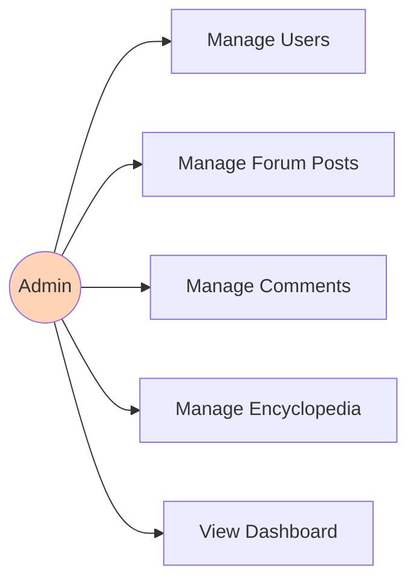
```mermaid
graph LR
    Admin((Admin))
    
    Admin --> UC1[Manage Users]
    Admin --> UC2[Manage Forum Posts]
    Admin --> UC3[Manage Comments]
    Admin --> UC4[Manage Encyclopedia]
    Admin --> UC5[View Dashboard]
    
    style Admin fill:#ffd3b6
```

---

## Data Flow Diagram (Level 0)

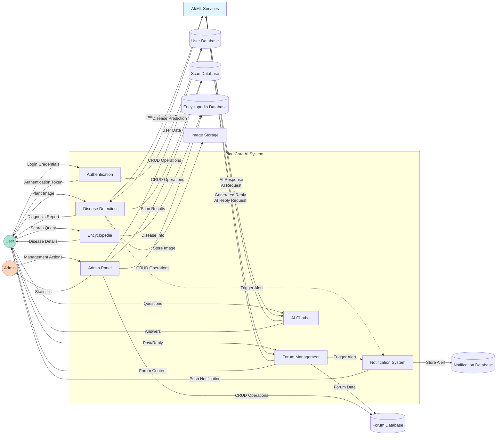
```mermaid
graph LR
    User((User))
    Admin((Admin))
    
    subgraph "PlantCare AI System"
        P1[Authentication]
        P2[Disease Detection]
        P3[Forum Management]
        P4[Encyclopedia]
        P5[AI Chatbot]
        P6[Admin Panel]
        P7[Notification System]
    end
    
    DS1[(User Database)]
    DS2[(Scan Database)]
    DS3[(Forum Database)]
    DS4[(Encyclopedia Database)]
    DS5[Image Storage]
    DS6[(Notification Database)]
    
    AI[AI/ML Services]
    
    User -->|Login Credentials| P1
    P1 -->|User Data| DS1
    P1 -->|Authentication Token| User
    
    User -->|Plant Image| P2
    P2 -->|Image Analysis Request| AI
    AI -->|Disease Prediction| P2
    P2 -->|Scan Results| DS2
    P2 -->|Store Image| DS5
    P2 -->|Diagnosis Report| User
    P2 -.->|Trigger Alert| P7
    
    User -->|Post/Reply| P3
    P3 -->|AI Reply Request| AI
    AI -->|Generated Reply| P3
    P3 -->|Forum Data| DS3
    P3 -->|Forum Content| User
    P3 -.->|Trigger Alert| P7
    
    User -->|Search Query| P4
    P4 -->|Disease Info| DS4
    P4 -->|Disease Details| User
    
    User -->|Questions| P5
    P5 -->|AI Request| AI
    AI -->|AI Response| P5
    P5 -->|Answers| User
    
    Admin -->|Management Actions| P6
    P6 -->|CRUD Operations| DS1
    P6 -->|CRUD Operations| DS2
    P6 -->|CRUD Operations| DS3
    P6 -->|CRUD Operations| DS4
    P6 -->|Statistics| Admin
    
    P7 -->|Store Alert| DS6
    P7 -->|Push Notification| User
    
    style AI fill:#e1f5ff
    style User fill:#a8e6cf
    style Admin fill:#ffd3b6
```

---

## Entity Relationship Diagram

```mermaid
erDiagram
    USER ||--o{ SCAN : creates
    USER ||--o{ FORUM_POST : creates
    USER ||--o{ FORUM_REPLY : creates
    USER ||--o{ NOTIFICATION : receives
    USER ||--o{ FORUM_LOVE : gives
    USER ||--o{ SESSION : has
    USER ||--o{ PASSWORD_RESET_TOKEN : requests
    
    FORUM_POST ||--o{ FORUM_REPLY : has
    FORUM_POST ||--o{ FORUM_POST_IMAGE : contains
    FORUM_POST ||--o{ FORUM_LOVE : receives
    
    FORUM_REPLY ||--o{ FORUM_REPLY : "has child"
    FORUM_REPLY ||--o{ FORUM_REPLY_IMAGE : contains
    FORUM_REPLY ||--o{ FORUM_LOVE : receives
    
    DISEASE_ENCYCLOPEDIA ||--o{ SCAN : "referenced in"
    
    USER {
        int id PK
        string name
        string email UK
        boolean is_admin
        string password
        timestamp email_verified_at
        string remember_token
        timestamp created_at
        timestamp updated_at
    }
    
    SCAN {
        int id PK
        int user_id FK
        string image_path
        enum status
        boolean is_healthy
        decimal is_healthy_probability
        json diagnosis
        text error_message
        timestamp created_at
        timestamp updated_at
    }
    
    FORUM_POST {
        int id PK
        int user_id FK
        string title
        text description
        string crop_type
        string disease_name
        text symptoms
        string location
        enum status
        boolean is_pinned
        int views_count
        int replies_count
        int loves_count
        timestamp last_activity_at
        timestamp created_at
        timestamp updated_at
        timestamp deleted_at
    }
    
    FORUM_REPLY {
        int id PK
        int forum_post_id FK
        int user_id FK
        int parent_id FK
        text content
        boolean is_solution
        int loves_count
        timestamp created_at
        timestamp updated_at
        timestamp deleted_at
    }
    
    FORUM_POST_IMAGE {
        int id PK
        int forum_post_id FK
        string image_path
        string caption
        int order
        timestamp created_at
        timestamp updated_at
    }
    
    FORUM_REPLY_IMAGE {
        int id PK
        int forum_reply_id FK
        string image_path
        string caption
        int order
        timestamp created_at
        timestamp updated_at
    }
    
    FORUM_LOVE {
        int id PK
        int user_id FK
        int loveable_id
        string loveable_type
        timestamp created_at
        timestamp updated_at
    }
    
    DISEASE_ENCYCLOPEDIA {
        int id PK
        string name
        string slug UK
        string plant_type
        string disease_type
        string severity
        text description
        json symptoms
        json treatment
        json prevention
        string common_season
        string favorable_conditions
        string image_url
        boolean is_healthy
        timestamp created_at
        timestamp updated_at
    }
    
    NOTIFICATION {
        int id PK
        int user_id FK
        string type
        string title
        text message
        string link
        json data
        timestamp read_at
        timestamp created_at
        timestamp updated_at
    }
    
    SESSION {
        string id PK
        int user_id FK
        string ip_address
        text user_agent
        text payload
        int last_activity
    }
    
    PASSWORD_RESET_TOKEN {
        string email PK
        string token
        timestamp created_at
    }

    CACHE {
        string key PK
        mediumText value
        int expiration
    }

    CACHE_LOCKS {
        string key PK
        string owner
        int expiration
    }

    JOBS {
        int id PK
        string queue
        longText payload
        tinyint attempts
        int reserved_at
        int available_at
        int created_at
    }

    JOB_BATCHES {
        string id PK
        string name
        int total_jobs
        int pending_jobs
        int failed_jobs
        longText failed_job_ids
        mediumText options
        int cancelled_at
        int created_at
        int finished_at
    }

    FAILED_JOBS {
        int id PK
        string uuid UK
        text connection
        text queue
        longText payload
        longText exception
        timestamp failed_at
    }

    HEALTH_CHECK_RESULT_HISTORY_ITEMS {
        int id PK
        string check_name
        string check_label
        string status
        text notification_message
        string short_summary
        json meta
        timestamp ended_at
        uuid batch
        timestamp created_at
        timestamp updated_at
    }
```

---

## Sequence Diagrams

### 1. User Registration and Login

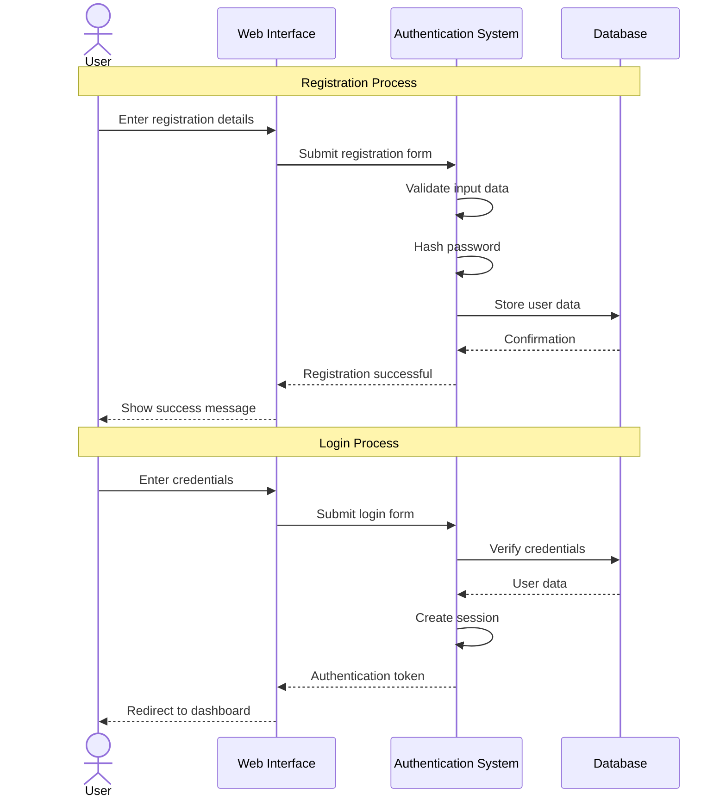
```mermaid
sequenceDiagram
    actor User
    participant Web as Web Interface
    participant Auth as Authentication System
    participant DB as Database
    
    Note over User,DB: Registration Process
    User->>Web: Enter registration details
    Web->>Auth: Submit registration form
    Auth->>Auth: Validate input data
    Auth->>Auth: Hash password
    Auth->>DB: Store user data
    DB-->>Auth: Confirmation
    Auth-->>Web: Registration successful
    Web-->>User: Show success message
    
    Note over User,DB: Login Process
    User->>Web: Enter credentials
    Web->>Auth: Submit login form
    Auth->>DB: Verify credentials
    DB-->>Auth: User data
    Auth->>Auth: Create session
    Auth-->>Web: Authentication token
    Web-->>User: Redirect to dashboard
```

### 2. Plant Disease Detection

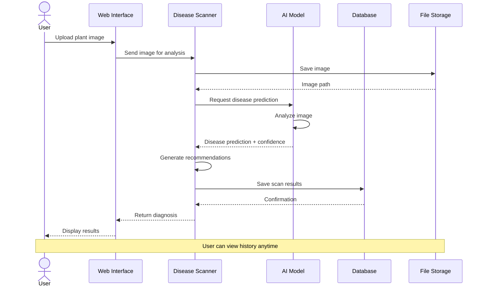
```mermaid
sequenceDiagram
    actor User
    participant Web as Web Interface
    participant Scanner as Disease Scanner
    participant AI as AI Model
    participant DB as Database
    participant Storage as File Storage
    
    User->>Web: Upload plant image
    Web->>Scanner: Send image for analysis
    Scanner->>Storage: Save image
    Storage-->>Scanner: Image path
    
    Scanner->>AI: Request disease prediction
    AI->>AI: Analyze image
    AI-->>Scanner: Disease prediction + confidence
    
    Scanner->>Scanner: Generate recommendations
    Scanner->>DB: Save scan results
    DB-->>Scanner: Confirmation
    
    Scanner-->>Web: Return diagnosis
    Web-->>User: Display results
    
    Note over User,Storage: User can view history anytime
```

### 3. Creating Forum Post with AI Reply

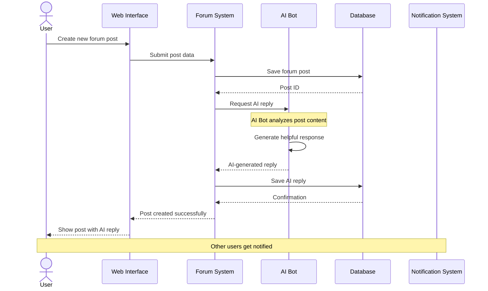
```mermaid
sequenceDiagram
    actor User
    participant Web as Web Interface
    participant Forum as Forum System
    participant AI as AI Bot
    participant DB as Database
    participant Notif as Notification System
    
    User->>Web: Create new forum post
    Web->>Forum: Submit post data
    Forum->>DB: Save forum post
    DB-->>Forum: Post ID
    
    Forum->>AI: Request AI reply
    Note over AI: AI Bot analyzes post content
    AI->>AI: Generate helpful response
    AI-->>Forum: AI-generated reply
    
    Forum->>DB: Save AI reply
    DB-->>Forum: Confirmation
    
    Forum-->>Web: Post created successfully
    Web-->>User: Show post with AI reply
    
    Note over User,Notif: Other users get notified
```

### 4. Community Interaction (Reply & Love)

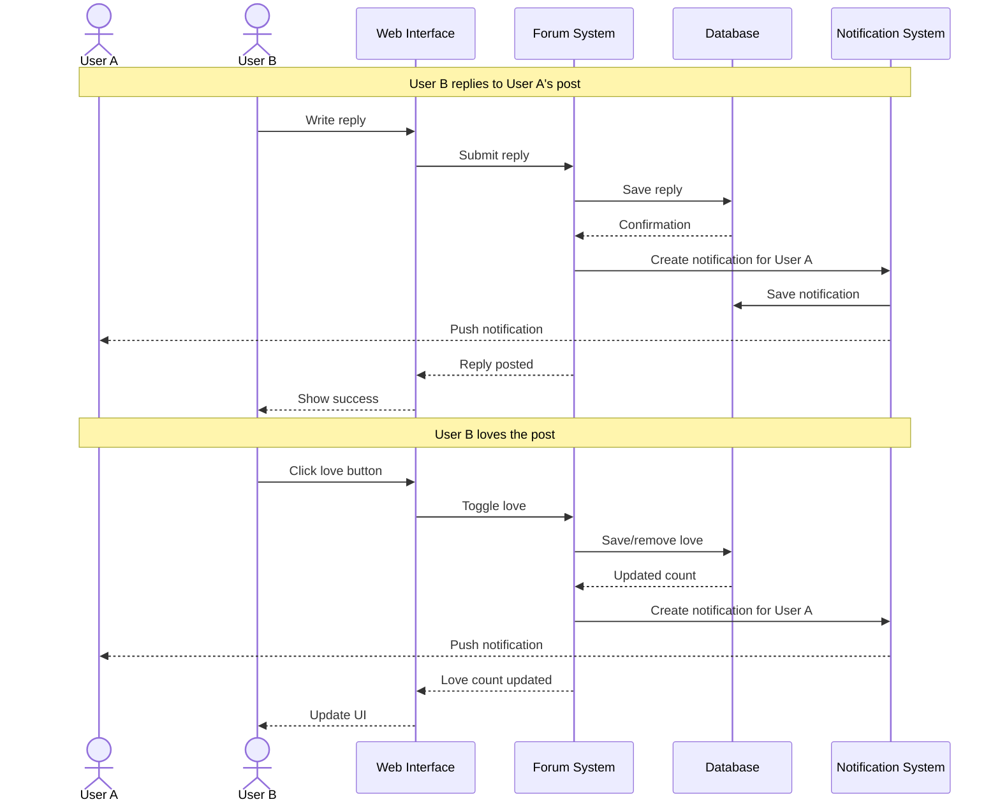
```mermaid
sequenceDiagram
    actor UserA as User A
    actor UserB as User B
    participant Web as Web Interface
    participant Forum as Forum System
    participant DB as Database
    participant Notif as Notification System
    
    Note over UserA,Notif: User B replies to User A's post
    UserB->>Web: Write reply
    Web->>Forum: Submit reply
    Forum->>DB: Save reply
    DB-->>Forum: Confirmation
    
    Forum->>Notif: Create notification for User A
    Notif->>DB: Save notification
    Notif-->>UserA: Push notification
    
    Forum-->>Web: Reply posted
    Web-->>UserB: Show success
    
    Note over UserA,Notif: User B loves the post
    UserB->>Web: Click love button
    Web->>Forum: Toggle love
    Forum->>DB: Save/remove love
    DB-->>Forum: Updated count
    
    Forum->>Notif: Create notification for User A
    Notif-->>UserA: Push notification
    
    Forum-->>Web: Love count updated
    Web-->>UserB: Update UI
```

### 5. AI Chatbot Interaction

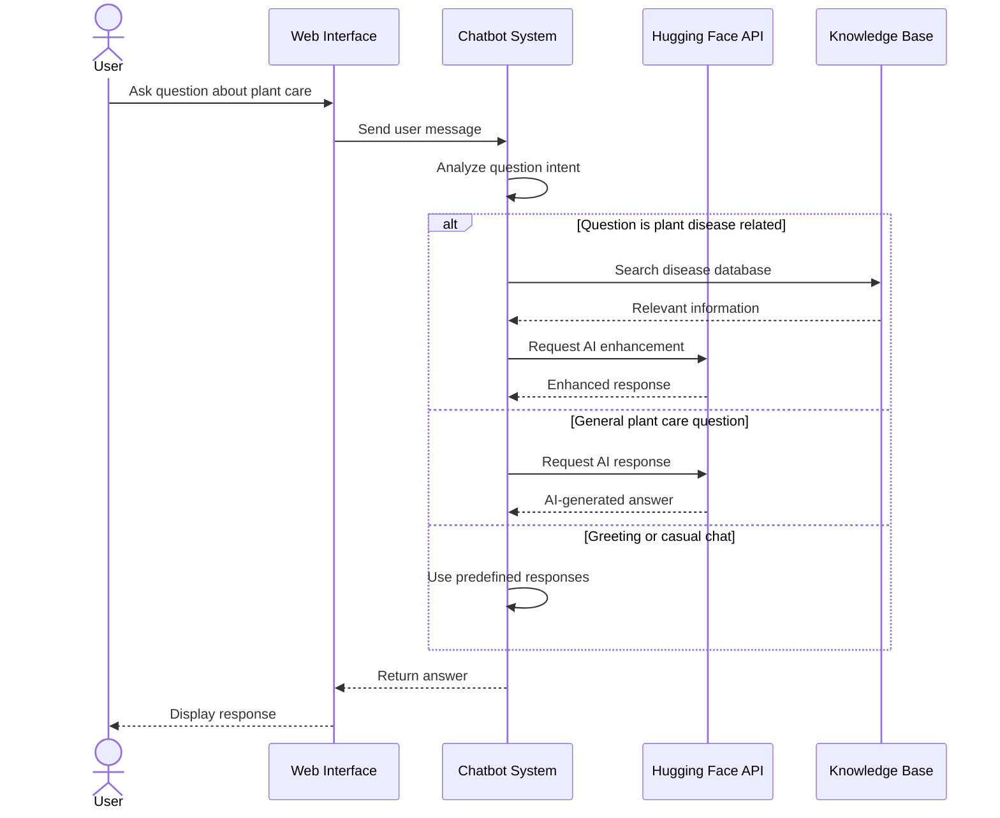
```mermaid
sequenceDiagram
    actor User
    participant Web as Web Interface
    participant Chatbot as Chatbot System
    participant AI as Hugging Face API
    participant KB as Knowledge Base
    
    User->>Web: Ask question about plant care
    Web->>Chatbot: Send user message
    
    Chatbot->>Chatbot: Analyze question intent
    
    alt Question is plant disease related
        Chatbot->>KB: Search disease database
        KB-->>Chatbot: Relevant information
        Chatbot->>AI: Request AI enhancement
        AI-->>Chatbot: Enhanced response
    else General plant care question
        Chatbot->>AI: Request AI response
        AI-->>Chatbot: AI-generated answer
    else Greeting or casual chat
        Chatbot->>Chatbot: Use predefined responses
    end
    
    Chatbot-->>Web: Return answer
    Web-->>User: Display response
```

### 6. Encyclopedia Search and View

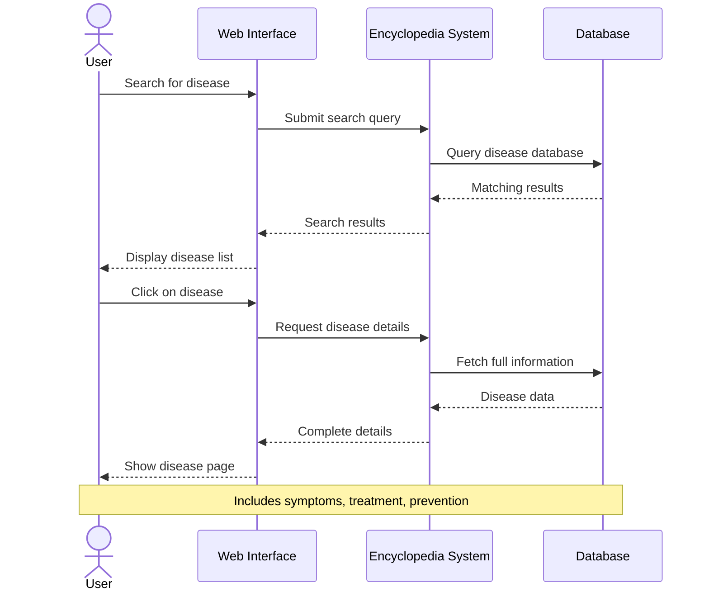
```mermaid
sequenceDiagram
    actor User
    participant Web as Web Interface
    participant Encyclopedia as Encyclopedia System
    participant DB as Database
    
    User->>Web: Search for disease
    Web->>Encyclopedia: Submit search query
    Encyclopedia->>DB: Query disease database
    DB-->>Encyclopedia: Matching results
    Encyclopedia-->>Web: Search results
    Web-->>User: Display disease list
    
    User->>Web: Click on disease
    Web->>Encyclopedia: Request disease details
    Encyclopedia->>DB: Fetch full information
    DB-->>Encyclopedia: Disease data
    Encyclopedia-->>Web: Complete details
    Web-->>User: Show disease page
    
    Note over User,DB: Includes symptoms, treatment, prevention
```

### 7. Admin - Manage Forum Posts

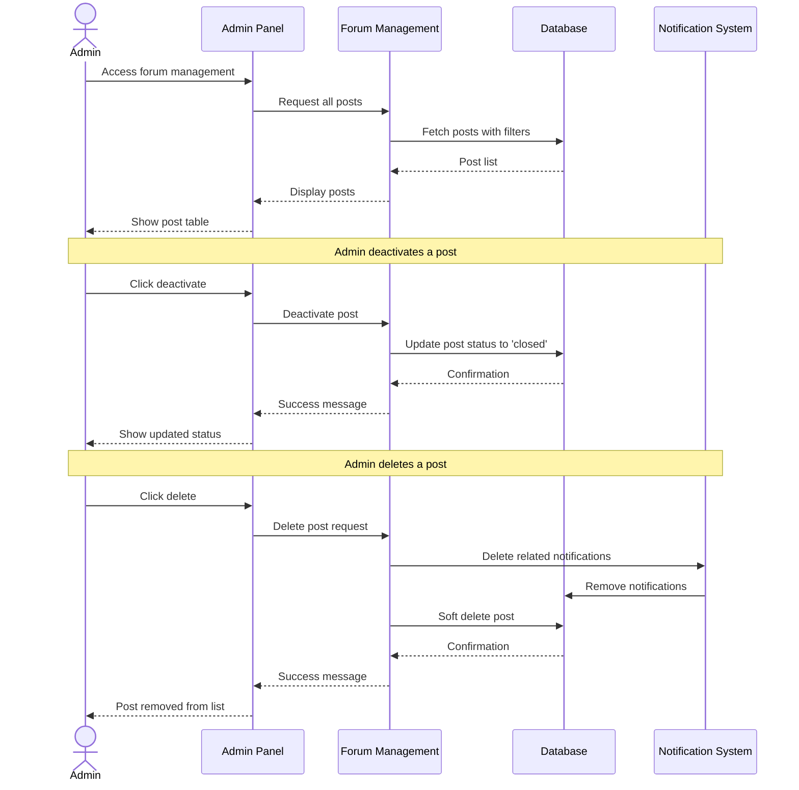
```mermaid
sequenceDiagram
    actor Admin
    participant Web as Admin Panel
    participant Forum as Forum Management
    participant DB as Database
    participant Notif as Notification System
    
    Admin->>Web: Access forum management
    Web->>Forum: Request all posts
    Forum->>DB: Fetch posts with filters
    DB-->>Forum: Post list
    Forum-->>Web: Display posts
    Web-->>Admin: Show post table
    
    Note over Admin,Notif: Admin deactivates a post
    Admin->>Web: Click deactivate
    Web->>Forum: Deactivate post
    Forum->>DB: Update post status to 'closed'
    DB-->>Forum: Confirmation
    Forum-->>Web: Success message
    Web-->>Admin: Show updated status
    
    Note over Admin,Notif: Admin deletes a post
    Admin->>Web: Click delete
    Web->>Forum: Delete post request
    Forum->>Notif: Delete related notifications
    Notif->>DB: Remove notifications
    Forum->>DB: Soft delete post
    DB-->>Forum: Confirmation
    Forum-->>Web: Success message
    Web-->>Admin: Post removed from list
```

### 8. Admin - Manage Encyclopedia

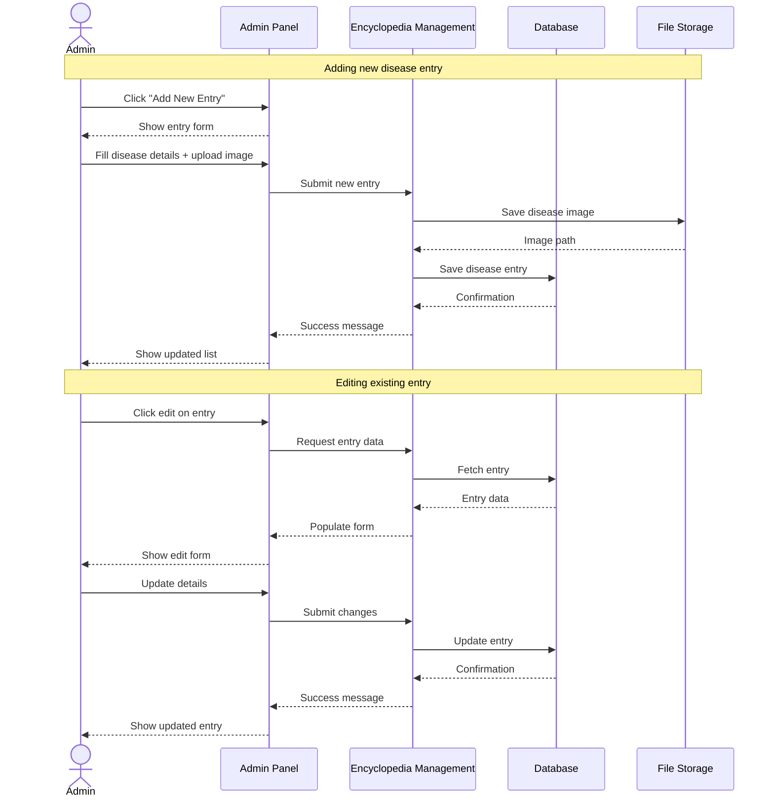
```mermaid
sequenceDiagram
    actor Admin
    participant Web as Admin Panel
    participant Encyclopedia as Encyclopedia Management
    participant DB as Database
    participant Storage as File Storage
    
    Note over Admin,Storage: Adding new disease entry
    Admin->>Web: Click "Add New Entry"
    Web-->>Admin: Show entry form
    
    Admin->>Web: Fill disease details + upload image
    Web->>Encyclopedia: Submit new entry
    Encyclopedia->>Storage: Save disease image
    Storage-->>Encyclopedia: Image path
    
    Encyclopedia->>DB: Save disease entry
    DB-->>Encyclopedia: Confirmation
    Encyclopedia-->>Web: Success message
    Web-->>Admin: Show updated list
    
    Note over Admin,Storage: Editing existing entry
    Admin->>Web: Click edit on entry
    Web->>Encyclopedia: Request entry data
    Encyclopedia->>DB: Fetch entry
    DB-->>Encyclopedia: Entry data
    Encyclopedia-->>Web: Populate form
    Web-->>Admin: Show edit form
    
    Admin->>Web: Update details
    Web->>Encyclopedia: Submit changes
    Encyclopedia->>DB: Update entry
    DB-->>Encyclopedia: Confirmation
    Encyclopedia-->>Web: Success message
    Web-->>Admin: Show updated entry
```

### 9. Notification System

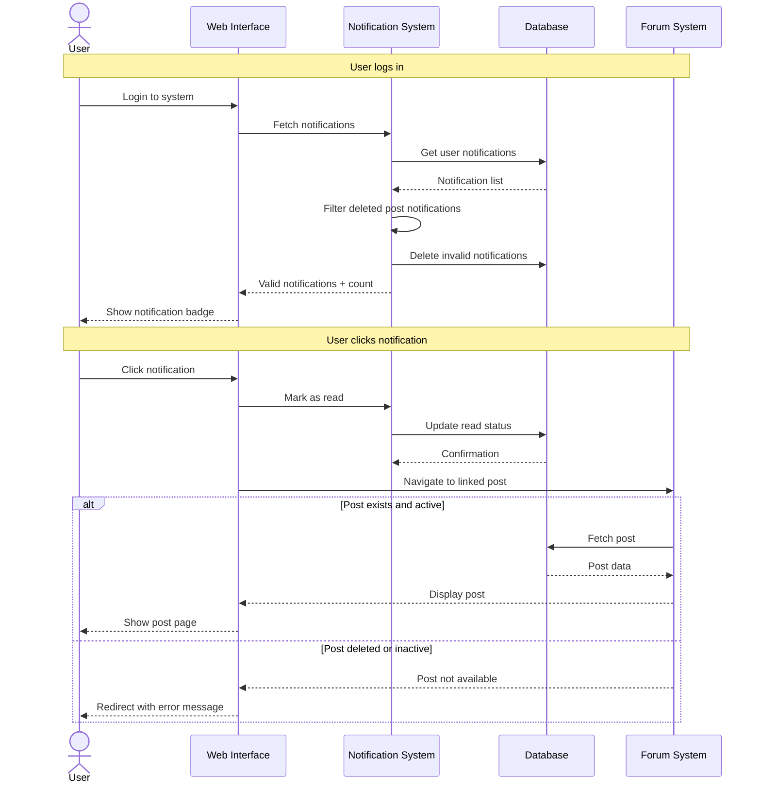
```mermaid
sequenceDiagram
    actor User
    participant Web as Web Interface
    participant Notif as Notification System
    participant DB as Database
    participant Forum as Forum System
    
    Note over User,Forum: User logs in
    User->>Web: Login to system
    Web->>Notif: Fetch notifications
    Notif->>DB: Get user notifications
    DB-->>Notif: Notification list
    
    Notif->>Notif: Filter deleted post notifications
    Notif->>DB: Delete invalid notifications
    
    Notif-->>Web: Valid notifications + count
    Web-->>User: Show notification badge
    
    Note over User,Forum: User clicks notification
    User->>Web: Click notification
    Web->>Notif: Mark as read
    Notif->>DB: Update read status
    DB-->>Notif: Confirmation
    
    Web->>Forum: Navigate to linked post
    
    alt Post exists and active
        Forum->>DB: Fetch post
        DB-->>Forum: Post data
        Forum-->>Web: Display post
        Web-->>User: Show post page
    else Post deleted or inactive
        Forum-->>Web: Post not available
        Web-->>User: Redirect with error message
    end
```

### 10. User Profile Management

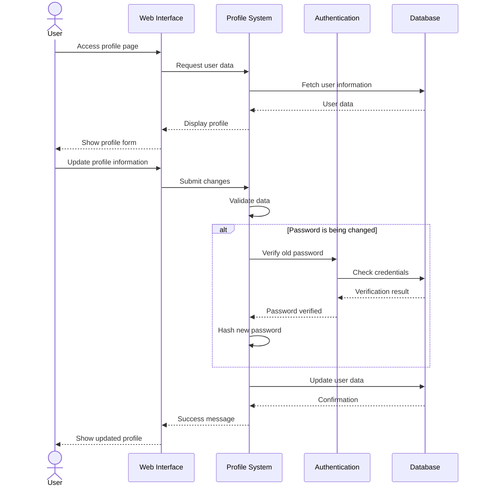
```mermaid
sequenceDiagram
    actor User
    participant Web as Web Interface
    participant Profile as Profile System
    participant Auth as Authentication
    participant DB as Database
    
    User->>Web: Access profile page
    Web->>Profile: Request user data
    Profile->>DB: Fetch user information
    DB-->>Profile: User data
    Profile-->>Web: Display profile
    Web-->>User: Show profile form
    
    User->>Web: Update profile information
    Web->>Profile: Submit changes
    Profile->>Profile: Validate data
    
    alt Password is being changed
        Profile->>Auth: Verify old password
        Auth->>DB: Check credentials
        DB-->>Auth: Verification result
        Auth-->>Profile: Password verified
        Profile->>Profile: Hash new password
    end
    
    Profile->>DB: Update user data
    DB-->>Profile: Confirmation
    Profile-->>Web: Success message
    Web-->>User: Show updated profile
```

---

## System Workflow Summary

### For Regular Users:
1. **Register/Login** → Access the system
2. **Scan Plant** → Upload image → Get AI diagnosis
3. **Browse Encyclopedia** → Learn about diseases
4. **Join Community** → Create posts, reply, interact
5. **Use AI Assistant** → Get instant answers
6. **Receive Notifications** → Stay updated on interactions

### For Administrators:
1. **Login to Admin Panel** → Access management dashboard
2. **Monitor Statistics** → View system analytics
3. **Moderate Forum** → Activate/deactivate/delete posts
4. **Manage Comments** → Remove inappropriate content
5. **Maintain Encyclopedia** → Add/edit disease information
6. **Ensure Quality** → Keep the platform helpful and safe

---

## Key System Benefits

### For Users:
- **Quick Diagnosis**: Instant disease detection using AI
- **Expert Knowledge**: Access to comprehensive disease encyclopedia
- **Community Support**: Connect with other plant enthusiasts
- **24/7 Assistance**: AI chatbot available anytime
- **Track History**: View all previous scans and posts

### For Administrators:
- **Centralized Control**: Manage all aspects from one dashboard
- **Data Insights**: View statistics and user activity
- **Content Moderation**: Ensure quality discussions
- **Knowledge Management**: Maintain accurate disease information
- **User Safety**: Protect community from spam and abuse

---

*This documentation provides a comprehensive overview of the PlantCare AI system architecture and functionality, designed for academic and technical review purposes.*
